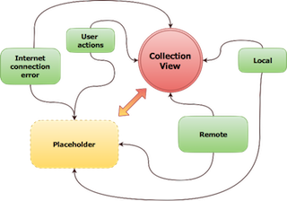

# Stefan

## Why?

As a mobile developers we all have to handle displaying collections of data. But is it always as simple as it sounds? 



Looks like spaghetti? It's common situation that application displays data / placeholders (which may be different depends for example on loading state) and some of us end with defining states and tangle everything together. 


Stefan is a framework that helps you to manage states in your collection views. Basically it is a middle man between data source and the view itself. Of course it supports UITableView and UICollectionView out of box, but it's up to you to decide what is your **ReloadableView** and what is **PlaceholderView**. It contains most commonly used states that might occur when loading data collection. 

### Basic setup 

- Define Stefan object, the best solution is to define one Stefan per one ReloadableView.
- Connect Stefan's reloadableView and placeholderPresenter (which both might be nil).
> Remember that class that implements LoadableStatePlaceholderPresentable must **weakly** reference to a placeholderView.
- Call `stefan.load(newState ...)` 

### Few words about placeholder

- We've tried to make it as flexible as possible, you can provide custom placeholder view which should conform from `LoadableStatePlaceholderView` and also from `ItemsLoadableStateBindable`. To display custom placeholder view just implement your own version of `LoadableStatePlaceholderPresentable` function `customPlaceholderView`. 

- There is also default placeholder view built from title, subtitle and activity indicator which might also be useful for you. Feel free to see how it works in example project. 

Project is created and maintened by **Piotr Bernad** and **Szymon Mrozek**.


### Carthage

Make the following entry in your Cartfile:

```
github "appunite/Stefan"
```

Then run `carthage update`.


### Cocoapods

For now there is no support for Cocoapods.

### Project Status

The project is under development now. It is not ready to use in production yet. We are drafting the idea now. Won't reccomend using it in production before we make our code well tested.

### Known issues

• Nothing yet

### Contribution

We could use your help with reporting or fixing bugs. We would like to also hear from you about features suggestions. If you have some idea how to make Stefan better please send us Pull Request.
