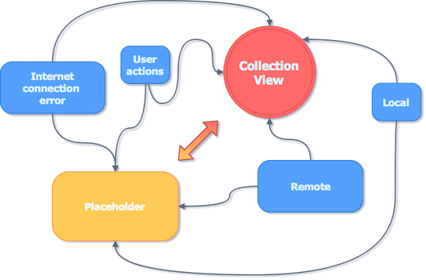
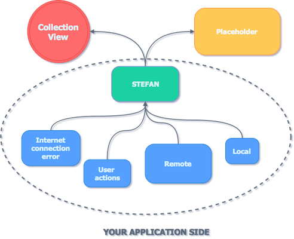

<p align="center">
  
</p>

## Why?

As mobile developers we all have to handle displaying collections of data. But is it always as simple as it sounds? 

<p align="center">
  
</p>

Looks like spaghetti? It is a common situation that application displays data / placeholders (which may be different depending for example on loading state) and some of us end up with defining states and tangling everything together. 

<p align="center">
  
</p>

**Stefan** is a framework that helps you to manage states in your collection views. Basically it is a middleman between data source and the view itself. Of course it supports UITableView and UICollectionView out of box, but it is up to you to decide what is your **ReloadableView** and what is **PlaceholderView**. It contains most commonly used states that might occur when loading data collection. 

### Basic setup 

- Define `Stefan` object, the best solution is to define one `Stefan` per one `ReloadableView`.
- Connect Stefan's `reloadableView` and `placeholderPresenter` (which both might be `nil`).
> Remember: class that implements LoadableStatePlaceholderPresentable must have a **weak** reference to a placeholderView.
- Call `stefan.load(newState: ...)` 

Example of setup:

```swift
private func setupStefan() {
	viewModel.stefan.reloadableView = self.tableView
	viewModel.stefan.placeholderPresenter = self
	viewModel.stefan.load(newState: .noContent) // initial state
}
```

For reading current items just call 

```swift
try stefan.state.items()
```

### Few words about placeholder

- We have tried to make it as flexible as possible so you can provide a custom placeholder view which should conform to `LoadableStatePlaceholderView` and also implement `ItemsLoadableStateBindable` protocol. To display custom placeholder view just implement your own version of function `customPlaceholderView` that is handled by Stefan's `placeholderPresenter`. 

Example for customization: 

```swift
public func customPlaceholderView() -> LoadableStatePlaceholderView {
	let view = LoadingPlaceholderView.instanceFromNib()
    view.dataSource = self.viewModel
    return view
}
```

- There is also a default placeholder view built from title, subtitle and activity indicator which might also be useful for you. Feel free to see how it works in the example project. 

### Closures

To make Stefan fully generic we provided delegate by common closures pattern. Following delegate closures are available: 

```swift
public var shouldReload: ((ReloadableView!) -> Bool)
    
public var didChangeState: ((ItemsLoadableState<ItemType>) -> Void)
    
public var shouldDisplayPlaceholder: ((ItemsLoadableState<ItemType>) -> Bool)
```

### Differing 

Stefan provides default implementation of differring function which result should be `ItemReloadingResult`. This result tells Stefan what should be reloaded (or maybe there is nothing to do for him). You can provide your own implementation by defining 

`stefan.statesDiffer = ...` 

Please remember that this is a weak object so you have to handle retaining it. 

Stefan has a `Differ` dependency which is needed for performing fast operations on collections while comparing. When initializing Stefan you are able to provide reloading type which might be `animated` or `basic`. By default animations are disabled, but when you'll enable it Stefan will handle collection animation automatically by himself.

### RxStefan

We've added some **RxSwift** extensions for **Stefan** please follow [this repo](https://github.com/appunite/RxStefan).


### Carthage

Add the following entry in your Cartfile:

```
github "appunite/Stefan"
```

Then run `carthage update`.


### Cocoapods

Add the following entry in your Podfile

```
pod 'Stefan'
```

Then run `pod install`.

### Known issues

• Nothing yet

### Contribution

Project is created and maintened by **Piotr Bernad** and **Szymon Mrozek**.

We could use your help with reporting or fixing bugs. We would also like to hear from you about feature suggestions. If you have an idea how to make Stefan better you are welcome to send us a Pull Request.

### License

Stefan is released under an MIT license. See [License.md](LICENSE.md) for more information.
